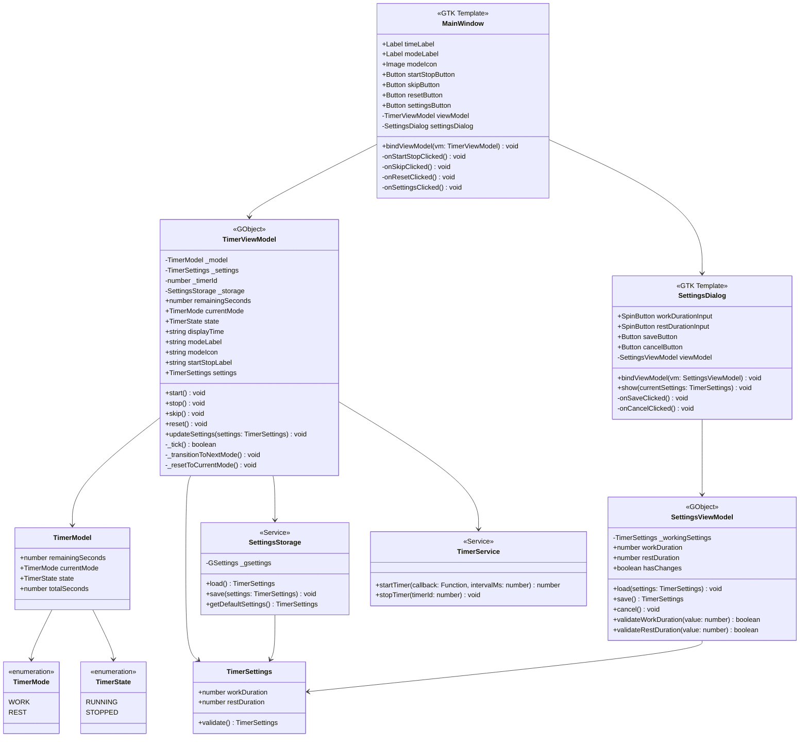

# Architecture Design Document

## Overview

This document describes the architecture and class design for the Pomodoro Timer application, following the MVVM (Model-View-ViewModel) pattern as specified in CLAUDE.md.

## Architecture Pattern: MVVM

The application is structured using the MVVM pattern to separate concerns and enable effective property binding with GTK:

- **Models**: Define data structures using Zod schemas (`src/models/`)
- **ViewModels**: Implement business logic as GObject classes (`src/viewModels/`)
- **Views**: Define UI layout using GTK `.ui` template files (`src/view/`)

## Class Diagram



## Component Details

### Models (`src/models/`)

#### 1. TimerMode (Enum)
```typescript
enum TimerMode {
  WORK = 'WORK',
  REST = 'REST'
}
```

Represents the two timer modes:
- `WORK`: Focus work session
- `REST`: Break period

#### 2. TimerState (Enum)
```typescript
enum TimerState {
  RUNNING = 'RUNNING',
  STOPPED = 'STOPPED'
}
```

Represents timer execution state:
- `RUNNING`: Timer is counting down
- `STOPPED`: Timer is paused/stopped

#### 3. TimerSettings (Zod Schema)
```typescript
const TimerSettingsSchema = z.object({
  workDuration: z.number().positive().int(),    // minutes
  restDuration: z.number().positive().int()     // minutes
});

type TimerSettings = z.infer<typeof TimerSettingsSchema>;
```

**Properties:**
- `workDuration`: Duration of work sessions in minutes (default: 25)
- `restDuration`: Duration of rest breaks in minutes (default: 5)

#### 4. TimerModel (Zod Schema)
```typescript
const TimerModelSchema = z.object({
  remainingSeconds: z.number().nonnegative().int(),
  currentMode: z.nativeEnum(TimerMode),
  state: z.nativeEnum(TimerState),
  totalSeconds: z.number().positive().int()
});

type TimerModel = z.infer<typeof TimerModelSchema>;
```

**Properties:**
- `remainingSeconds`: Current remaining time in seconds
- `currentMode`: Current timer mode (WORK or REST)
- `state`: Current timer state (RUNNING or STOPPED)
- `totalSeconds`: Total seconds for the current mode

### ViewModels (`src/viewModels/`)

#### 1. TimerViewModel (GObject)

**Responsibility:**
- Manages timer state and business logic
- Handles countdown operations
- Orchestrates mode transitions
- Exposes properties for view binding

**GObject Properties (for GTK binding):**
- `remainingSeconds: number` - Current remaining time in seconds
- `currentMode: TimerMode` - Current mode (WORK/REST)
- `state: TimerState` - Timer state (RUNNING/STOPPED)
- `displayTime: string` - Formatted time string (MM:SS)
- `modeLabel: string` - Human-readable mode label ("Work" / "Rest")
- `modeIcon: string` - Icon name for current mode
- `startStopLabel: string` - Dynamic button label ("Start" / "Stop")
- `settings: TimerSettings` - Current timer settings

**Methods:**
- `start()` - Starts/resumes the countdown timer
- `stop()` - Pauses the countdown timer
- `skip()` - Discards current timer and transitions to next mode (stopped state)
- `reset()` - Resets current timer to initial duration and stops
- `updateSettings(settings: TimerSettings)` - Updates timer configuration
- `_tick()` - Internal: Called every second to update countdown
- `_transitionToNextMode()` - Internal: Switches between WORK ↔ REST (stopped state)
- `_resetToCurrentMode()` - Internal: Resets timer to current mode's duration

**Behavior Notes:**
- Uses `TimerService` (wraps `GLib.timeout_add`) for countdown
- When timer reaches 0:00, transitions to next mode in STOPPED state
- Mode transition: WORK → REST → WORK → REST...
- Settings changes apply to next timer cycle

#### 2. SettingsViewModel (GObject)

**Responsibility:**
- Manages settings dialog state
- Validates user input
- Handles save/cancel operations

**GObject Properties:**
- `workDuration: number` - Work session duration in minutes
- `restDuration: number` - Rest break duration in minutes
- `hasChanges: boolean` - Indicates unsaved changes

**Methods:**
- `load(settings: TimerSettings)` - Loads current settings into dialog
- `save()` - Validates and returns updated settings
- `cancel()` - Discards changes and reverts to loaded settings
- `validateWorkDuration(value: number)` - Validates work duration input
- `validateRestDuration(value: number)` - Validates rest duration input

### Services/Utilities

#### 1. SettingsStorage

**Responsibility:**
- Persists settings using GSettings
- Loads settings on startup
- Provides default values

**Methods:**
- `load(): TimerSettings` - Loads settings from GSettings
- `save(settings: TimerSettings)` - Saves settings to GSettings
- `getDefaultSettings(): TimerSettings` - Returns default settings (25min work, 5min rest)

**GSettings Schema:**
```
org.example.pomodoro.settings
  - work-duration (int, default: 25)
  - rest-duration (int, default: 5)
```

#### 2. TimerService

**Responsibility:**
- Wraps GLib.timeout_add for timer operations
- Manages timer lifecycle

**Methods:**
- `startTimer(callback: Function, intervalMs: number): number` - Starts interval timer, returns timer ID
- `stopTimer(timerId: number)` - Stops running timer by ID

**Implementation Note:**
- Uses `GLib.timeout_add_seconds(1, callback)` for 1-second intervals
- Ensures timer accuracy regardless of window focus

### Views (`src/view/`)

#### 1. MainWindow.ui (GTK Template)

**UI Components:**
- **Timer Display Area (Upper):**
  - `modeIcon` (GtkImage) - Icon representing current mode
  - `timeLabel` (GtkLabel) - Displays MM:SS countdown
  - `modeLabel` (GtkLabel) - Displays "Work" or "Rest"

- **Control Buttons (Lower):**
  - `startStopButton` (GtkButton) - Start/Stop toggle
  - `skipButton` (GtkButton) - Skip to next mode
  - `resetButton` (GtkButton) - Reset current timer

- **Settings Button (Upper Right):**
  - `settingsButton` (GtkButton) - Opens settings dialog

**Property Bindings:**
- `timeLabel.label` ← `TimerViewModel.displayTime`
- `modeLabel.label` ← `TimerViewModel.modeLabel`
- `modeIcon.icon-name` ← `TimerViewModel.modeIcon`
- `startStopButton.label` ← `TimerViewModel.startStopLabel`

**Event Handlers:**
- `onStartStopClicked()` - Calls `viewModel.start()` or `viewModel.stop()`
- `onSkipClicked()` - Calls `viewModel.skip()`
- `onResetClicked()` - Calls `viewModel.reset()`
- `onSettingsClicked()` - Opens `SettingsDialog`

#### 2. SettingsDialog.ui (GTK Template)

**UI Components:**
- `workDurationInput` (GtkSpinButton) - Work duration input (min: 1, max: 120 minutes)
- `restDurationInput` (GtkSpinButton) - Rest duration input (min: 1, max: 60 minutes)
- `saveButton` (GtkButton) - Save settings
- `cancelButton` (GtkButton) - Cancel without saving

**Property Bindings:**
- `workDurationInput.value` ↔ `SettingsViewModel.workDuration`
- `restDurationInput.value` ↔ `SettingsViewModel.restDuration`
- `saveButton.sensitive` ← `SettingsViewModel.hasChanges`

**Event Handlers:**
- `onSaveClicked()` - Saves settings and closes dialog
- `onCancelClicked()` - Discards changes and closes dialog

## Data Flow

### 1. Application Startup
```
Main → SettingsStorage.load() → TimerViewModel (initialize)
     → MainWindow.ui (load template)
     → Bind ViewModel properties to View
```

### 2. Timer Operation
```
User clicks Start
  → MainWindow.onStartStopClicked()
  → TimerViewModel.start()
  → TimerService.startTimer(_tick, 1000ms)
  → _tick() updates remainingSeconds
  → GObject property notification
  → GTK updates bound UI labels
```

### 3. Mode Transition (Auto)
```
_tick() detects remainingSeconds === 0
  → _transitionToNextMode()
  → currentMode: WORK → REST (or REST → WORK)
  → state: RUNNING → STOPPED
  → remainingSeconds = totalSeconds of new mode
  → GObject property notifications update UI
```

### 4. Settings Update
```
User clicks Settings button
  → SettingsDialog.show(currentSettings)
  → SettingsViewModel.load(currentSettings)
  → User modifies values
  → User clicks Save
  → SettingsViewModel.save()
  → TimerViewModel.updateSettings(newSettings)
  → SettingsStorage.save(newSettings)
```

## Visual Design

### Mode Indicators

**Work Mode:**
- Icon: `⏰` (work-symbolic or preferences-system-time-symbolic)
- Text: "Work"
- Color scheme: Red/Orange tones (optional)

**Rest Mode:**
- Icon: `☕` (preferences-desktop-screensaver-symbolic or emoji)
- Text: "Rest"
- Color scheme: Green/Blue tones (optional)

## Technical Implementation Notes

### GObject Property Binding

ViewModels must expose properties using GObject.ParamSpec for GTK binding:

```typescript
// Example property definition in TimerViewModel
GObject.registerClass({
  Properties: {
    'remaining-seconds': GObject.ParamSpec.int(
      'remaining-seconds',
      'Remaining Seconds',
      'Current remaining time in seconds',
      GObject.ParamFlags.READABLE,
      0, Number.MAX_SAFE_INTEGER, 0
    ),
    // ... other properties
  }
}, class TimerViewModel extends GObject.Object {
  // Implementation
});
```

### Timer Accuracy

Use `GLib.timeout_add_seconds` for 1-second intervals instead of JavaScript `setInterval` to ensure:
- Better integration with GLib main loop
- Accurate countdown even when window is unfocused
- Lower CPU usage

### Settings Persistence (GSettings)

GSettings schema file (`org.example.pomodoro.gschema.xml`):
```xml
<?xml version="1.0" encoding="UTF-8"?>
<schemalist>
  <schema id="org.example.pomodoro.settings" path="/org/example/pomodoro/settings/">
    <key name="work-duration" type="i">
      <default>25</default>
      <summary>Work session duration</summary>
      <description>Duration of work sessions in minutes</description>
    </key>
    <key name="rest-duration" type="i">
      <default>5</default>
      <summary>Rest break duration</summary>
      <description>Duration of rest breaks in minutes</description>
    </key>
  </schema>
</schemalist>
```

## Directory Structure

```
src/
├── models/
│   ├── TimerMode.ts          # TimerMode enum
│   ├── TimerState.ts         # TimerState enum
│   ├── TimerSettings.ts      # TimerSettings Zod schema
│   └── TimerModel.ts         # TimerModel Zod schema
│
├── viewModels/
│   ├── TimerViewModel.ts     # Main timer business logic
│   └── SettingsViewModel.ts  # Settings dialog logic
│
├── view/
│   ├── MainWindow.ui         # Main window GTK template
│   └── SettingsDialog.ui     # Settings dialog GTK template
│
├── services/
│   ├── SettingsStorage.ts    # GSettings persistence
│   └── TimerService.ts       # GLib timer wrapper
│
└── main.ts                   # Application entry point
```

## Future Enhancements

- Desktop notifications when timer completes (using `Gio.Notification`)
- Audio notifications (using `Gst.Player` or system sounds)
- Statistics tracking (completed work sessions, total focus time)
- Long break mode after N work sessions (e.g., 4 work → 15min long break)
- Tray icon with timer display
- Keyboard shortcuts (Space: Start/Stop, R: Reset, S: Skip)
